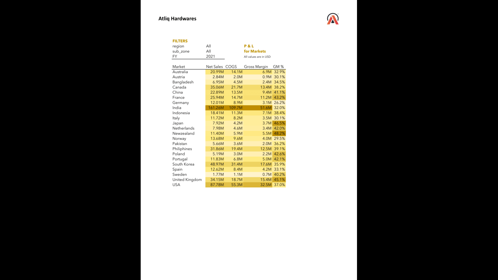
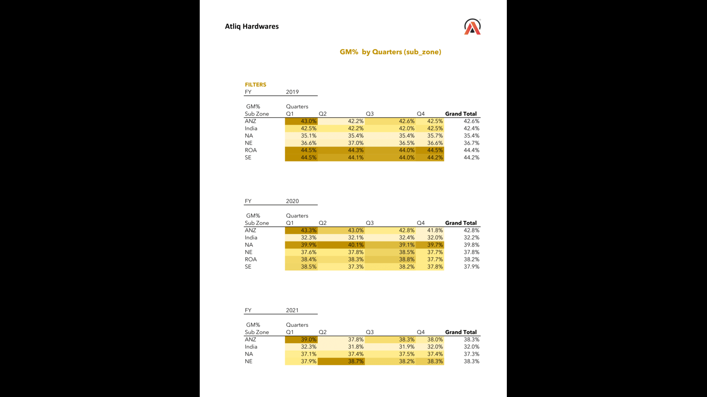

# Excel Financial Analysis – MIS Reports

This repository showcases financial reporting projects created using **Excel**, **Power Query**, and **Pivot Tables**. These projects focus on automating financial data analysis, improving accuracy, and providing actionable insights.

---

## Projects

### 1. P&L Report – AtliQ Hardware (FY 2022)
- **Tools:** Excel, Pivot Tables, Power Query
- **Highlights:**
  - Automated data cleaning, saving ~4 hours of manual work
  - DAX-based calculations for enhanced accuracy (~30% improvement)
  - Detailed Profit & Loss insights for strategic decision-making

**Screenshot:**

---

### 2. Quarterly GM% by Sub-Zones (2019–2021)
- **Tools:** Excel, Pivot Tables
- **Highlights:**
  - Trend analysis of Gross Margin % across sub-zones
  - Enabled comparison across regions and time periods
  - Simplified visualization for better reporting and decision-making

**Screenshot:**

---

## Features
- Automated financial data processing with Power Query
- Interactive dashboards using Pivot Tables
- Accurate calculations with DAX formulas
- Visual insights to support business decisions

---

